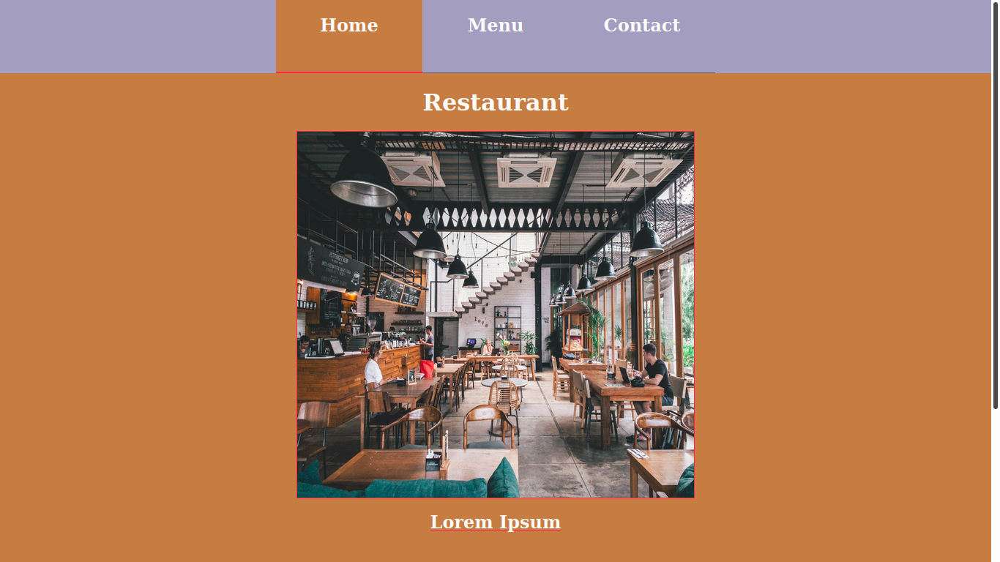

# Restaurant Page
A project based on JS DOM manipulation, modules system and Webpack in particular . 


## Project Decription
A javascript project which renders a Restaturant page where users can interact with site to veiw mune. 
The project is about the use of Webpack and the implementation of parkage.json.


## Screenshot of the page



## Build With

- HTML
- CSS
- JAVASCRIPT
- Webpack

## Getting Started

1. Open Terminal.
2. Copy and paste the following code into the Terminal to clone it: git clone https://github.com/TSHEPO-CLOUD/restaurant_page/tree/feature-branch
3. ```cd restaurant_page```.
4. Run `npm install` command.
5. Navigate to index.html and open the file with your desired browser to preview it.


## Contributors

👤 **TSHEPO DAVID MOLEFE**

- [GitHub](https://github.com/TSHEPO-CLOUD)
- [Twitter](https://twitter.com/tshepomolefem)
- [LinkedIn](https://www.linkedin.com/in/tshepo-molefe-8153313b)


## 🤝 Contributing

Contributions, issues and feature requests are welcome!

Feel free to check the [issues page](issues/).

## Show your support

Give a ⭐️ if you like this project!

